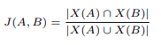
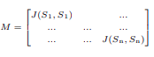

# BiNGO-3C: Binary Encoding of Genomic Sequences for Optimal Compression, Comparison and Clustering

## Abstract
The vast amount of data generated by sequencing technologies gave rise to the need for faster and adequate algorithms. Statistical comparison methods for the comparison of biological sequences based on word-counts such as k-mer have shown great potential. However the characters-string-based representation of DNA and the redundancy of common words leave much to be desired, in terms of memory and complexity optimization. Here, we explore the potential optimization of the classic alignment-free sliding-window for sequence comparison by introducing a new representation of DNA sequences for optimal time and memory consumption.
 
To reduce the memory and time consumption in our approach, we start by splitting the long DNA sequence into smaller words of size s and a gap h, as in any other sliding-window algorithm.  We then change the representation of the words from DNA bases (A, C, G and T) to a 2-bit binary format (00, 01, 10 and 11) respectively, then to the numeric value corresponding to the resulting binary string. This step significantly reduces the storage-memory as well as the computation time for the next steps. Finally the set of numeric values are compared to each other and clustered using Jaccard-Similarity Index to compute a similarity score.

 
## Material and Methods 
### Sliding window  
Our method is based on the comparison of sets of elements instead of entire sequences, similar to any other wordcomparison based methods. First, for every sequence S, the set of words is established by using Ws,g, such that W is a slidingwindow of size s and using a gap (g) to split DNA sequences into small sub-sequences (words) of size s, such that s ≥ 3 and g ≥ 1. K-mers, for instance, are a special case where s = k and g = 1. Higher g or s values can be used to decrease the number of words generated, however, this may lead to random skips of words and impact comparison accuracy, particularly when dealing with long or highly similar sequences. 
To address this, we adjust the sliding-window pointer on different positions of the compared sequences using randomly selected sub-sequences as delimiters. This allows resetting the pointer at similar positions in both sequences thus mitigating noise, frame-shift errors, and INDELs. 
### Binary encoding 
Typically, the words generated from split the S sequence are represented as a succession of w characters from a given set of letters representing DNA bases A = A, C, G, T. In order to minimize storage and computational time requirements, we propose a more compact representation of DNA sequences for our approach. This is achieved by first converting the subsequences into a binary format, where DNA bases are assigned to unique 2-bit identifiers, by mapping the four bases onto binary numbers as in Table 1. This first step allows representing each character using only 2 bits (size of binary number) instead of 8 to 16 bits occupied by characters in the standard character representation. Next, the binary characters constituting each binary word is represented by decimal or hexadecimal numbers that takes significantly less size in the memory. 
### Similarity Score: 
We estimate, J, the similarity level between a pair of genomic sequences A and B using Jaccard-Similarity Index J. Jaccard similarity index is defined as the ratio of intersection between two sets divided by the their union (21). In our case, the two samples X(A) and X(B) the sets of binarized words generated from the two sequences A and B, and it is defined as in equation

| Character   | Binary |
| ----------- | ----------- |
| A           | 00     |
| C           | 01     |
| G           | 10     |
| T           | 11     |

with X(A) and X(B) being the sets of numerical values extracted from sequences A and B. Based on this, we compute the similarity scores between each pair of sequences J(Si, Sj) for any given dataset D of N > 2 sequences which are elements of a symmetric similarity matrix M of size N (see equation 2). Finally, we perform hierarchical clustering on the matrix to group the sequences.

## Test and validation
The following four datasets were used to validate the accuracy of our method. all sequence data can be retrieved from public datasets using the reference numbers provided in the Supplementary Tables: 
• A simulation dataset 

• A genus-level dataset of 31 Betacoronavirus Genomes from Na Zhu, et al. (2020) 

|ID | Species |
| ----------- | ----------- |
| MN908947.3 | Severe acute respiratory syndrome coronavirus 2 isolate Wuhan-Hu-1|
| AY508724.1 | SARS coronavirus NS-1|
| AY485277.1 | SARS coronavirus Sino1-11|
| AY390556.1 | SARS coronavirus GZ02|
| AY278489.2 | SARS coronavirus GD01|
| KT444582.1 | SARS-like coronavirus WIV16|
| KY417146.1 | Bat SARS-like coronavirus isolate Rs4231|
| KY417151.1 | Bat SARS-like coronavirus isolate Rs7327|
| KY417152.1 | Bat SARS-like coronavirus isolate Rs9401|
| MK211376.1 | Coronavirus BtRs-BetaCoV/YN2018B|
| MK211377.1 | Coronavirus BtRs-BetaCoV/YN2018C|
| MK211374.1 | Coronavirus BtRl-BetaCoV/SC2018|
| KY770859.1 | Sarbecovirus sp. isolate Anlong-112|
| KJ473816.1 | BtRs-BetaCoV/YN2013|
| KJ473815.1 | BtRs-BetaCoV/GX2013|
| JX993988.1 | Bat coronavirus Cp/Yunnan2011|
| KY417145.1 | Bat SARS-like coronavirus isolate Rf4092|
| KY417142.1 | Bat SARS-like coronavirus isolate As6526|
| KY417148.1 | Bat SARS-like coronavirus isolate Rs4247|
| MG772934.1 | Bat SARS-like coronavirus isolate bat-SL-CoVZXC21|
| KF636752.1 | Bat Hp-betacoronavirus/Zhejiang2013|
| EF065513.1 | Rousettus bat coronavirus HKU9|
| EF065505.1 | Tylonycteris bat coronavirus HKU4|
| KU762338.1 | Rousettus bat coronavirus isolate GCCDC1 356|
| EF065509.1 | Pipistrellus bat coronavirus HKU5|
| JX869059.2 | Human betacoronavirus 2c EMC/2012|
| KC545386.1 | Betacoronavirus Erinaceus/VMC/DEU/2012 isolate ErinaceusCoV/2012-216/GER/2012|
| KM349744.1 | Betacoronavirus HKU24 strain HKU24-R05010I|
| AY391777.1 | Human coronavirus OC43|
| MK167038.1 | Human coronavirus HKU1 strain SC2521|
| FJ647223.1 | Murine coronavirus MHV-1|

• A strain-level dataset of 25 SARS-CoV-2 genomes from Essabbar, et al. (2021) 

| Clade   | Country |ID | Date|
| ----------- | ----------- |----------- |----------- |
|BA.1|USA|EPI_ISL_12697379|2022-03-30
|BA.1|Chile|EPI_ISL_12695409|2022-03-27
|BA.1|Belgium|EPI_ISL_12695268|2022-05-07
|BA.1|Morocco|EPI_ISL_12590790|2022-04-06
|BA.1|Japan|EPI_ISL_12690808|2022-04-01
|AY.1|India|EPI_ISL_12356501|2021-07-31
|AY.1|Nigeria|EPI_ISL_4490115|2021-07-27
|AY.1|Portugal|EPI_ISL_6115474|2021-05-24
|AY.1|USA|EPI_ISL_12693093|2021-08-25
|AY.1|Paraguay|EPI_ISL_4259556|2021-08-19
|B.1.1.7|South Africa|EPI_ISL_12587925|2021-05-14
|B.1.1.7|Brazil|EPI_ISL_12426387|2021-08-05
|B.1.1.7|USA|EPI_ISL_12698088|2021-06-29
|B.1.1.7|Spain|EPI_ISL_12689944|2021-02-02
|B.1.1.7|Japan|EPI_ISL_12332030|2021-04-23
|B.1.351|Bangladesh|EPI_ISL_11901837|2021-06-29
|B.1.351|France|EPI_ISL_12562299|2021-06-26
|B.1.351|Gabon|EPI_ISL_11522683|2021-02-16
|B.1.351|Gabon|EPI_ISL_12388545|2021-07-05
|B.1.351|Chile|EPI_ISL_2892956|2021-06-23
|P.1|Brazil|EPI_ISL_12573131|2021-08-03
|P.1|USA|EPI_ISL_12625197|2021-04-04
|P.1|Angola|EPI_ISL_2493026|2021-03-22
|P.1|Spain|EPI_ISL_11767046|2021-04-12
|P.1|South Korea|EPI_ISL_10189545|2021-04-22

• A class-level dataset of 30 mammalian mitochondrial genomes from seven clusters: Primates, Carnivora, Cetartiodactyla, Perissodactyla, Eulipotyphla, Lagomorpha, and Rodentia (25).

| ID   | Species |
| ----------- | ----------- |
| V00662 | Human |
| D38116 | pigmy chimpanzee |
| D38113 | common chimpanzee |
| X99256 | Gibbon |
| Y18001 | Baboon |
| AY863426 | vervet monkey |
| NC002764 | Macaca thibetana |
| D38115 | bornean orang-utan |
| NC002083 | sumatran orang-utan |
| D38114 | Gorilla |
| U20753 | Cat |
| U96639 | Dog |
| AJ002189 | Pig |
| AF010406 | Sheep |
| AF533441 | Goat |
| V00654 | Cow |
| AY488491 | Buffalo |
| EU442884 | Wolf |
| EF551003 | Tiger |
| EF551002 | Leopard |
| X97336 | indian rhinoceros |
| Y07726 | white rhinoceros |
| DQ402478 | black bear |
| AF303110 | brown bear |
| AF303111 | polar bear |
| EF212882 | giant panda |
| AJ001588 | Rabbit |
| X83898 | Hedgehog |
| AJ001562 | Dormouse |
| AJ238588 | Squirrel |
| X72204 | blue whale |
